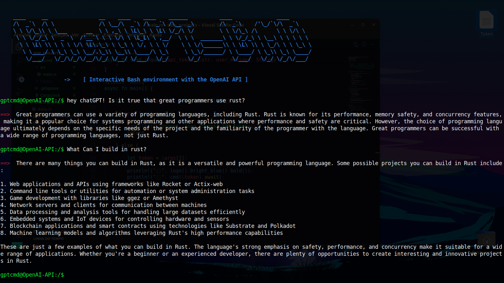

# ChatGPT-Cmd
Simple terminal emulator for interacting with the ChatGPT 3.5 service. Made in Rust, using the OpenAI API. It was created with the intention of using the service without the need for a web interface, focusing only on the occasional use of a simple terminal.

### Flags:

---------------

<div>
    
    
    
    
    
</div>

----------------



## Installation:

```bash
  git clone https://github.com//JMoreira2Dev/ChatGPT-Cmd.git
  cd ChatGPT-Cmd
  cargo build --release
```

or

```bash
  cargo install --git=https://github.com//JMoreira2Dev/ChatGPT-Cmd.git
```

## Usage: 

> ./app {OpenAI token key}

##

### Generating a ChatGPT API service key:

#### Step 1: Log in OpenAI


Select `API`

#### Step 2: Go into API keys


#### Step 3: Click on the Generate secret key button and save it:


## More info (Used Crates):

- **Colored Documentation** => [Colored](https://crates.io/crates/colored)
- **Chat_gpt_rs Documentation** => [Chat_gpt_rs](https://crates.io/crates/chat-gpt-rs)
- **OpenAI API** => [API](https://www.geeksforgeeks.org/openai-python-api/)
